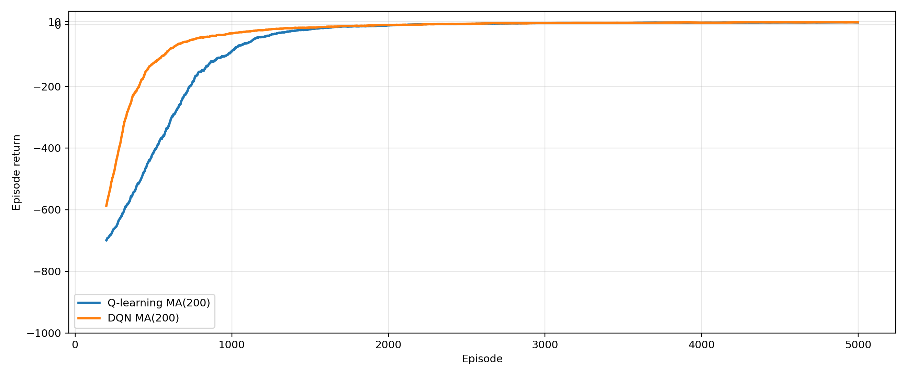
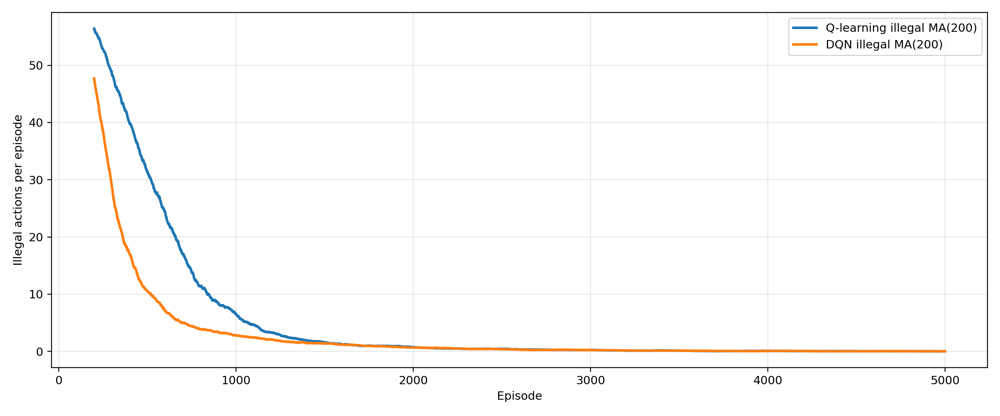

# Taxi-v3: Q-learning vs DQN

This repo compares **tabular Q-learning** and **Deep Q-Network (DQN)** on **Gymnasium Taxi-v3**.
It includes training curves (moving average) and greedy-policy GIF demos after training.

## Results
### Episode return (moving average)


### Illegal actions (moving average)


### Policy demos (greedy after training)
**Q-learning:**   
**DQN:** 

## Quickstart
```bash
pip install -r requirements.txt
python run_this.py

